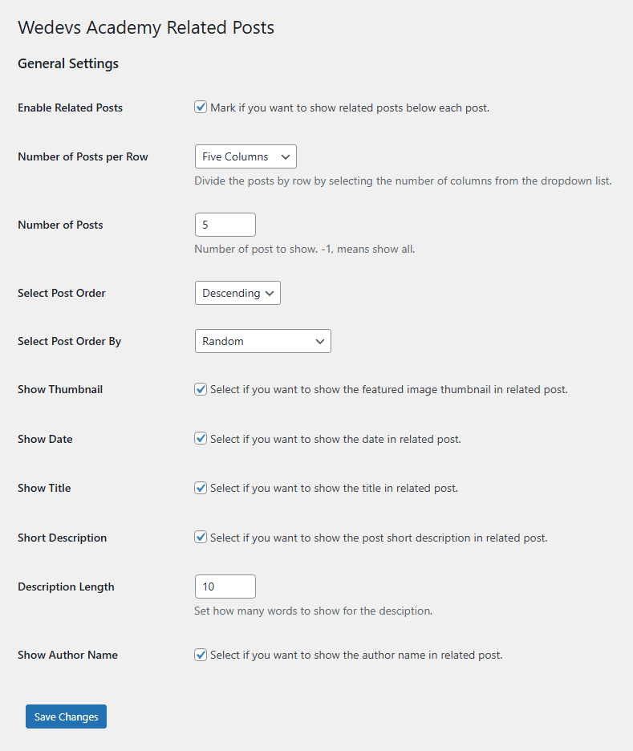
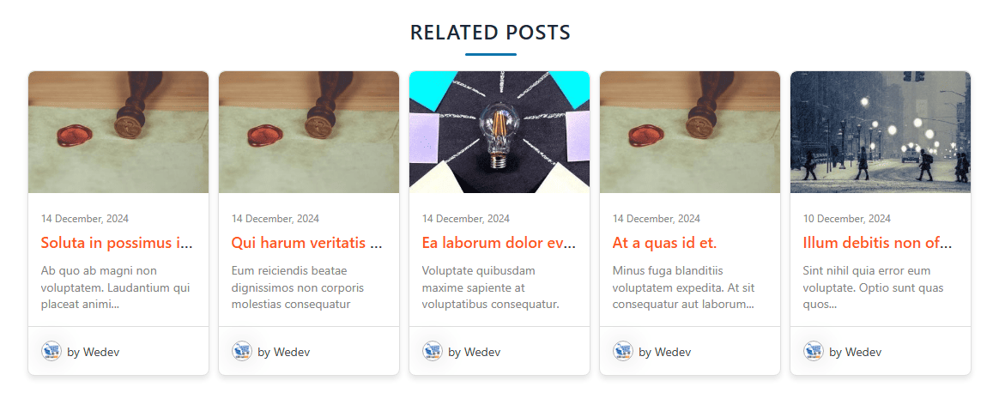

# RWC Related Posts

**RWC Related Posts** is a WordPress plugin that dynamically displays related posts based on the categories of the current post. Enhance user engagement by showing relevant content to your readers.

---

## Installation

1. **Download the Plugin**
   - Download the plugin ZIP file from the repository or source.

2. **Upload to WordPress**
   - Log in to your WordPress admin dashboard.
   - Navigate to `Plugins` > `Add New`.
   - Click on the `Upload Plugin` button and select the downloaded ZIP file.

3. **Install and Activate**
   - Click the `Install Now` button.
   - Once installed, click the `Activate Plugin` link to activate it.

---

## Features

- Automatically displays related posts based on categories.
- Configurable options, including short descriptions and custom description lengths.
- Lightweight and optimized for performance.
- Includes CSS for easy styling.

---

## Usage

1. **Ensure the Plugin is Active**
   - After activation, the plugin will automatically append related posts to the end of your blog posts.

2. **Customize Plugin Settings**
   - Go to `Related Posts` > `RWC Related Posts`.
   - Configure the following options:
     - **Enable Related Posts**: Mark if you want to display related posts below each blog post.
     - **Enter Related Posts Heading**: Enter a heading for the Related Posts. This will appear at the beginning of the Realated Posts using `<h3>` HTML tags.
     - **Number of Posts per Row**: Divide the related posts into rows by selecting the number of columns from the dropdown list.
     - **Number of Posts**: Specify the number of related posts to display. Use -1 to show all available posts.
     - **Select Post Order**: Define the order in which posts are displayed, such as ascending or descending.
     - **Select Post Order By**: Choose the parameter by which posts should be ordered, e.g., date, title, or random.
     - **Show Thumbnail**: Enable or disable the display of featured image thumbnails for related posts.
     - **Show Date**: Select if you want the publication date of the posts to be visible.
     - **Show Title**: Enable or disable the display of post titles in the related posts section.
     - **Short Description**: Enable or disable post short descriptions in the related posts section.
     - **Description Length**: Set the number of words for the short description (default: 10).
     - **Show Author Name**: Enable or disable the display of the author’s name for each related post.

3. **Styling**
   - The plugin includes a default CSS file. If needed, you can override styles in your theme’s stylesheet.

4. **Developer Notes**
   - To customize the appearance or functionality, refer to the plugin code located in the `/includes` directory.

---

## Screenshots

1. **Related Posts Display**
   

2. **Plugin Settings Page**
   

---

## **License**

This plugin is licensed under the [GPLv3 or later](https://www.gnu.org/licenses/gpl-3.0.html).

---

## **Support**

If you encounter any issues or have questions, please open an issue on the [GitHub repository](https://github.com/realwebcare/RWC-Frontend-Dashboard.git).

---

## **Credits**

Developed by [Realwebcare](https://www.realwebcare.com/).
